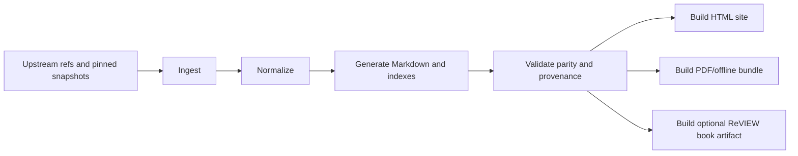

# Design: author-docs hub foundation

## Decision
`review-author-docs` は、ReVIEW 著者支援のための派生ドキュメントハブとする。一次配布面は静的 HTML サイト、一次編集面は Markdown、派生配布面として PDF/offline bundle と ReVIEW 書籍成果物を扱う。

この判断の理由は次の通り。
- 著者が最も必要とするのは「いま知りたいタグ説明」に素早く辿れることなので、全文検索と横断リンクに強い HTML が最優先になる。
- しかし、保守と差分管理は Markdown のほうが圧倒的に扱いやすいため、source of truth は Markdown に置く。
- ReVIEW の書籍成果物は象徴的価値と配布可能性があるが、検索性・更新性では HTML に劣るため、派生物に置く。

## Source Authority Model
| Source class | Upstream owner | Role in this repo | Authority level |
| --- | --- | --- | --- |
| Official ReVIEW docs | `kmuto/review` | 構文・設定・基本動作の根拠 | Normative |
| TECHZIP repo evidence | TECHZIP project outputs | 頻出タグ、誤用、実利用文脈の整理 | Descriptive |
| VS Code diagnostics dictionary / rules | `dev/vscode` | Nextpublishing 組版制約、禁止タグ、代替案 | Policy |
| Local authored docs | `review-author-docs` | 上記 3 系統をつなぐ導線・編集・注釈 | Derived |

ルール:
- upstream truth は upstream のまま保持する。
- この repo では pinned manifest と生成結果だけを持ち、上流の norm/policy を黙ってローカル改変しない。
- generated 文書は provenance を持ち、human-authored 文書と明示的に分離する。

## Directory Design
```text
review-author-docs/
├─ AGENTS.md
├─ specs/
│  └─ author-docs-hub-foundation/
├─ docs/
│  ├─ adr/
│  ├─ spec/
│  │  ├─ syntax/
│  │  └─ config/
│  ├─ policy/
│  │  └─ nextpublishing/
│  ├─ usage/
│  │  ├─ tag-atlas/
│  │  └─ anti-patterns/
│  ├─ workflows/
│  ├─ troubleshooting/
│  ├─ source-map/
│  ├─ current-state/
│  └─ session_handoffs/
├─ data/
│  ├─ upstream/
│  │  ├─ locks/
│  │  ├─ review/
│  │  ├─ techzip/
│  │  └─ vscode/
│  └─ normalized/
├─ generated/
│  ├─ markdown/
│  ├─ snippets/
│  ├─ indexes/
│  └─ source-map/
├─ site/
│  ├─ config/
│  ├─ theme/
│  └─ assets/
├─ scripts/
│  ├─ ingest/
│  ├─ normalize/
│  ├─ generate/
│  ├─ validate/
│  └─ publish/
└─ dist/
   ├─ html/
   ├─ pdf/
   ├─ offline/
   └─ review-book/
```

責務:
- `docs/`: 人が読む派生知識。生成対象と手書きガイドを含む。
- `data/upstream/`: upstream snapshot と lock 情報。
- `data/normalized/`: generator が扱う正規化データ。
- `generated/`: hand-edit 禁止の中間成果物。
- `site/`: HTML サイト組み立て設定。
- `dist/`: 配布成果物。CI や release で再生成される想定。

## Pipeline Specification


### Phase 1: ingest
- 入力:
  - ReVIEW 公式ドキュメント URL / pinned snapshot
  - TECHZIP 証跡出力
  - VS Code diagnostics dictionary と関連 rule 実装
- 出力:
  - `data/upstream/locks/upstream-lock.v1.yaml`
  - `data/upstream/{review,techzip,vscode}/...`
- 契約:
  - commit SHA, 取得日, source URL, extractor version を固定する

### Phase 2: normalize
- 入力:
  - upstream snapshot
- 出力:
  - `data/normalized/review-tags.v1.json`
  - `data/normalized/usage-observations.v1.json`
  - `data/normalized/nextpublishing-policy.v1.json`
- 契約:
  - official / usage / policy を混ぜずに別モデルで持つ

### Phase 3: generate
- 入力:
  - normalized JSON
  - hand-authored overlay templates
- 出力:
  - `generated/markdown/**/*.md`
  - `generated/indexes/**/*.json`
  - `generated/source-map/source-map.v1.json`
- 契約:
  - 各ページは `source_refs`, `authority_class`, `generated_at`, `generator_version` を保持する

### Phase 4: validate
- 入力:
  - generated outputs
  - upstream-lock
- 検証:
  - generated 直編集禁止チェック
  - source-map の全ページ対応チェック
  - VS Code diagnostics dictionary と rule 実装の整合
  - broken links / orphan pages / missing provenance
  - current-state と spec の更新漏れ

### Phase 5: publish
- 出力:
  - `dist/html/`
  - `dist/pdf/`
  - `dist/offline/`
  - `dist/review-book/`
- 方針:
  - HTML を primary
  - PDF/offline は配布用 convenience artifact
  - ReVIEW book は optional prestige/distribution artifact

## Delivery Format Assessment
| Format | Role | Strength | Weakness | Decision |
| --- | --- | --- | --- | --- |
| Markdown | Canonical source | 差分管理しやすい | そのままでは検索導線が弱い | Primary authoring |
| Static HTML | Primary delivery | 検索・導線・リンクに強い | ビルド設定が必要 | Primary delivery |
| PDF/offline | Secondary delivery | オフライン配布しやすい | 更新反映が遅い | Supported derivative |
| ReVIEW book | Optional derivative | 出版・配布の象徴性 | 検索・更新・構造再利用に弱い | Optional derivative |

## Site Generator Selection
一次 HTML 配布面の generator は Astro を採用する。

採用理由:
- Markdown を canonical source に保ったまま、`docs/` と `generated/` の両方を build-time 入力として扱いやすい。
- authority class ごとに分離した normalized JSON/YAML と、そこから生成する provenance-rich なページ群を route 単位で組み立てやすい。
- ingest / normalize / validate の主処理は `scripts/` 側に残しつつ、site layer では route generation と presentation だけを担わせやすい。

比較メモ:
| Option | Fit | 採用しなかった理由 |
| --- | --- | --- |
| Docusaurus | docs IA と versioning には強い | docs plugin 中心の前提が強く、authority-separated data model と source-map 駆動ページの比重が高い本 repo では site layer が窮屈になりやすい |
| MkDocs | Markdown 公開は最短で始めやすい | generated indexes / provenance / policy overlays を扱うには plugin 側に責務が寄りすぎ、repo の data-first contract と分離しづらい |
| Astro | Markdown と data collections の併用、静的 route 生成、薄い site shell に向く | 採用 |

ガードレール:
- Astro は static HTML publication surface を担う。upstream ingest / normalize / parity validation の authority は持たない。
- `site/` 以下には presentation, route composition, search/navigation, asset bundling だけを置く。
- `generated/` を直接編集しない前提を崩さない。

## Publication Target
公開先は GitHub Pages とし、運用アカウントは `irdtechbook` を使う。現在の repository 名を前提に、既定の project site URL は `https://irdtechbook.github.io/review-author-docs/` とする。

公開契約:
- publish target は GitHub Pages project site とする。
- デプロイは GitHub Actions を使い、Astro の static build を Pages artifact として公開する。
- custom domain は将来追加可能だが、foundation では `github.io` URL を canonical deployment target として扱う。
- relative links, base path, asset path は `/review-author-docs/` を前提に壊れないことを求める。

運用メモ:
- `irdtechbook.github.io` の user/organization site を占有する方針ではなく、この repo 単位の project site とする。
- private repo 運用可否や Pages visibility は GitHub 側設定に依存するが、仕様上は public static docs を前提にする。

## Upstream Lock Schema
`data/upstream/locks/upstream-lock.v1.yaml` は、各 authority source の pin と downstream mapping を 1 つの lock document に集約する。

想定 schema:
```yaml
schema_version: 1
lock_id: review-author-docs-upstream-lock
generated_at: 2026-04-10T17:30:00+09:00
generator:
  name: scripts/ingest/build_upstream_lock.py
  version: 0.1.0
sources:
  - source_id: review-format-ja
    authority_class: normative
    owner: kmuto/review
    capture_kind: git_blob
    origin:
      repo_url: https://github.com/kmuto/review
      ref: <commit-or-tag>
      path: doc/format.ja.md
    captured_at: 2026-04-10T17:30:00+09:00
    fingerprint: sha256:<digest>
    artifacts:
      raw_snapshot: data/upstream/review/doc/format.ja.md
      normalized_targets:
        - data/normalized/review-tags.v1.json
    refresh_policy:
      mode: manual-refresh
      parity_check: checksum-and-path
```

必須キー:
| Key | Meaning |
| --- | --- |
| `source_id` | repo 内で一意な pin 名 |
| `authority_class` | `normative`, `descriptive`, `policy` のいずれか |
| `owner` | upstream owner or project name |
| `capture_kind` | `git_blob`, `git_tree`, `json_file`, `generated_ledger` などの取得単位 |
| `origin` | URL / repo path / ref / local source path |
| `captured_at` | pin 取得日時 |
| `fingerprint` | 再取得比較用 digest |
| `artifacts.raw_snapshot` | 固定化した raw snapshot path |
| `artifacts.normalized_targets` | downstream 正規化出力 |
| `refresh_policy` | refresh 方法と drift 判定規則 |

source set:
- Official ReVIEW:
  - `review-format-ja`
  - `review-quickstart-ja`
  - `review-config-yml-sample`
- TECHZIP evidence:
  - `techzip-collection-manifest-lib`
  - `techzip-slack-evidence-lib`
  - `techzip-authoritative-ledger-lib`
- VS Code / Nextpublishing policy:
  - `vscode-banned-tag-rule`
  - `vscode-diagnostics-dictionary`

契約:
- source lock は file-level か logical artifact-level で pin し、directory 丸ごとの曖昧 pin を禁止する。
- TECHZIP evidence は raw source file と extracted evidence snapshot の両方を辿れるようにする。
- VS Code policy は dictionary と rule implementation を別 source_id で pin し、parity validator が両者を照合できるようにする。

## Next Implementation Spec Split
次段の implementation-facing spec は、foundation spec の直下ではなく lane ごとに独立させる。

| Spec | Scope | Outputs / goal |
| --- | --- | --- |
| `SPEC-RAD-002` | upstream ingest contract | upstream-lock schema, ingest inputs, refresh policy |
| `SPEC-RAD-003` | diagnostics parity contract | VS Code dictionary と rule 実装の parity validator |
| `SPEC-RAD-004` | source-map and generated immutability | provenance schema, source-map, generated no-hand-edit validation |

分割ルール:
- ingest lane は pin / snapshot / normalized target mapping までを責務とし、rendering を持たない。
- diagnostics parity lane は policy authority のみを扱い、official/descriptive source の解釈責務を持たない。
- source-map and immutability lane は generated outputs と publish gate を扱い、upstream pin の定義責務を持たない。
- site implementation は Astro selection を前提にするが、lane spec 完了までは foundation spec の decision を再定義しない。

## Content Information Architecture Phase
`content-information-architecture` phase は、ingest 済みの材料をどの導線・粒度・ページ種別で読ませるかを決める段階とする。これは site 実装そのものではなく、公開情報構造を固定する planning/spec phase である。

責務:
- 主要 audience と primary journeys を定義する
- サイトの top-level navigation と landing structure を定義する
- 各 content family の責務と authority mix 制限を定義する
- サイト版と書籍派生版の対応関係を定義する
- generated page templates と hand-authored overlay の境界を定義する

最小 deliverables:
- content map
- top navigation
- page type inventory
- tag atlas / policy guide / troubleshooting / workflow guide の entry criteria
- optional ReVIEW book 章立てへの mapping

content families:
| Family | Purpose | Primary authority |
| --- | --- | --- |
| Tag atlas | タグ単位で意味、使い方、注意点、代替案を引く | Normative + Policy |
| Policy guide | Nextpublishing 固有の禁止・警告と回避策を説明する | Policy |
| Usage notes | 実際の利用傾向、頻出パターン、誤用例を整理する | Descriptive |
| Config reference | config.yml sample と設定差分を説明する | Normative |
| Troubleshooting | 著者問い合わせや組版差し戻しに対する対処を整理する | Policy + Descriptive |
| Workflows | 執筆から preview までの作業導線を説明する | Derived |

navigation baseline:
- Home / Start Here
- Tag Atlas
- Nextpublishing Policy
- Config Reference
- Workflows
- Troubleshooting
- Source Map / Provenance

book-derivative policy:
- 書籍版はサイトの mirror ではなく、サイト導線を要約・再編成した curated derivative とする。
- 章立ては site navigation をそのまま写すのではなく、読了順に並べ替えてよい。
- ただし各章は site 側の page family と source-map で逆引きできること。

## Validation Contract
- `validate_current_state_docs.py` は常時 green を維持する。
- 将来追加する validation は少なくとも次を含む。
  - diagnostics parity
  - upstream lock completeness
  - source-map completeness
  - generated immutability
  - site build reproducibility

## Non-goals
- upstream repository の authority をこの repo に移すこと
- TECHZIP 証跡ロジックの再実装
- VS Code diagnostics ルールのローカル再定義

## Open Questions
- ReVIEW 派生物を CI 標準生成に含めるか、release 時だけ生成するか
- TECHZIP 証跡出力のどの粒度を lock 対象にするか
- Astro 側の search/navigation 実装を built-in + local index で閉じるか、外部 search integration を使うか
- Home / Start Here の editorial tone をどこまで beginner-oriented に振るか
